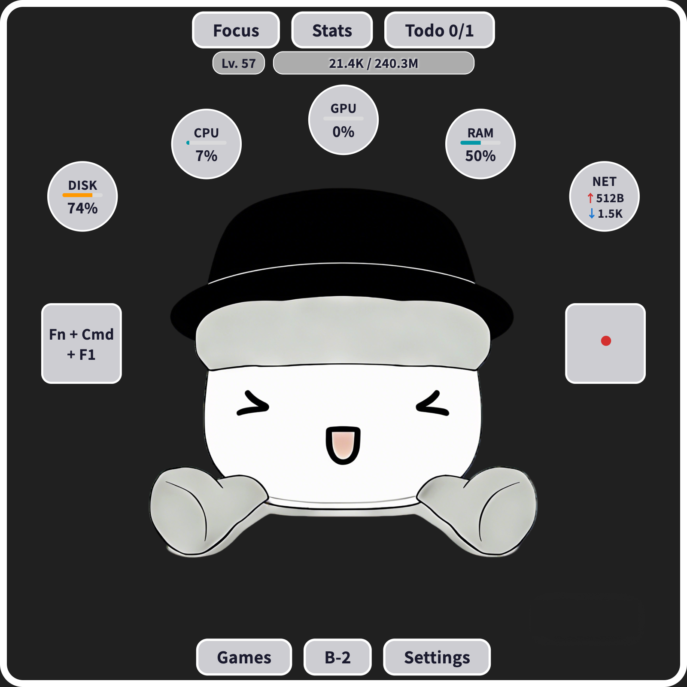

# Cyber Cultivation

[中文](README_ZH.md)

A gamified desktop companion that transforms your keyboard and mouse activity into an immersive cultivation journey. Level up your character while you work, stay focused with Pomodoro sessions, and track your productivity—all in a beautiful floating window.


## Screenshots

<p align="center">
  
</p>

## ✨ Features

### 🎮 Gamification & Progression
- **Cultivation System** — Gain EXP from keyboard/mouse activity, focus sessions, and mini-games to level up
- **Visual Level-Up Effects** — Stunning glow and particle burst animations when you level up
- **Floating EXP Indicators** — Real-time EXP gain notifications

### ⏱️ Productivity Tools
- **Pomodoro Timer** — Built-in focus timer with customizable work/relax durations and loops, featuring a beautiful cultivation formation animation
- **Todo List** — Manage daily tasks with persistent storage
- **Activity Statistics** — Daily/weekly keyboard and mouse usage charts

### 🖥️ System Monitoring
- **Real-time Stats** — CPU, GPU, RAM, disk usage, and network speed
- **Menu Bar Integration** — Display selected stats (Pomodoro, level, system info, battery) directly in macOS menu bar
- **Keyboard & Mouse Visualization** — Real-time input tracking with visual feedback

### 🎯 Mini Games
- **Snake** — Classic snake game with EXP rewards
- **Flappy Bird** — Tap-to-fly arcade game
- **Sudoku** — Brain-training puzzle with three difficulty levels

### 🛠️ Desktop Features
- **Always on Top** — Stay visible while you work
- **Anti-Sleep Mode** — Prevent screen sleep with periodic mouse movement
- **System Tray** — Quick access via tray icon with context menu
- **Launch at Login** — Start automatically with your system

### 🎨 Customization
- **Dark/Light Theme** — Comfortable viewing in any environment
- **Bilingual UI** — Full English and Chinese localization
- **Configurable Display** — Show/hide keyboard tracker, mouse tracker, and system stats

## 📦 Installation

### macOS

Download the latest `.dmg` from [Releases](../../releases) and drag to Applications.

> **Note**: On first launch, grant Accessibility permission when prompted (System Settings → Privacy & Security → Accessibility). This is required for keyboard and mouse monitoring.

### Build from Source

```bash
git clone https://github.com/user/cyber-cultivation.git
cd cyber-cultivation
flutter pub get
flutter run -d macos
```

**Prerequisites**: Flutter SDK 3.10+, Xcode Command Line Tools

## 🎯 Usage

| Action          | Description                                                |
| --------------- | ---------------------------------------------------------- |
| **Drag**        | Move the window anywhere on screen                         |
| **Right-click** | Open context menu (settings, Pomodoro, stats, games, etc.) |
| **Resize**      | Drag window edges (maintains 1:1 aspect ratio)             |
| **Tray Icon**   | Click for quick access menu                                |

## ❓ FAQ

### App won't open / "damaged" warning

If macOS blocks the app with a security warning (Gatekeeper), run:

```bash
xattr -d com.apple.quarantine /Applications/CyberCultivation.app
```

### Accessibility permission not working

After granting Accessibility permission, **quit and relaunch** the app for it to take effect.

### Need to reset Accessibility permission

If the app was updated/reinstalled and keyboard/mouse monitoring stops working, reset the permission:

```bash
tccutil reset Accessibility com.lichen.cyberCultivation
```

Then relaunch the app and grant permission again.

## Contributing

Contributions welcome! See [Contributing Guidelines](docs/CONTRIBUTING.md).

## 📄 License

[PolyForm Noncommercial License 1.0.0](LICENSE)

- ✅ Free for personal, educational, non-profit use
- ❌ Commercial use requires separate license

---

<p align="center">
  <i>Turn your daily computer activity into an epic cultivation journey! 🧘‍♂️⌨️</i>
</p>