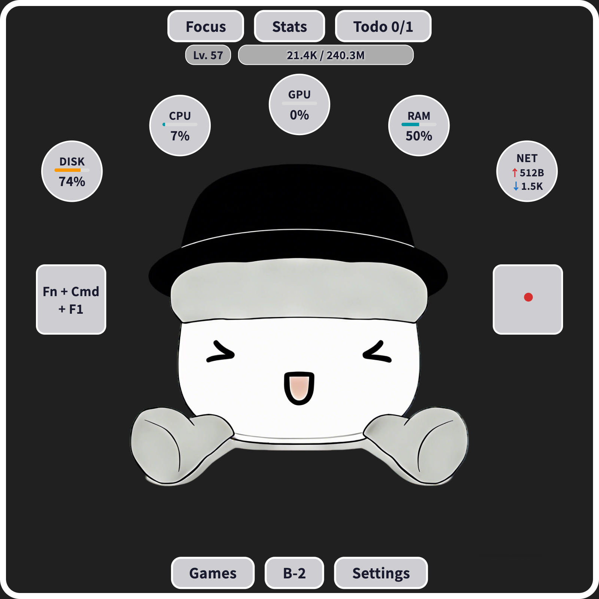
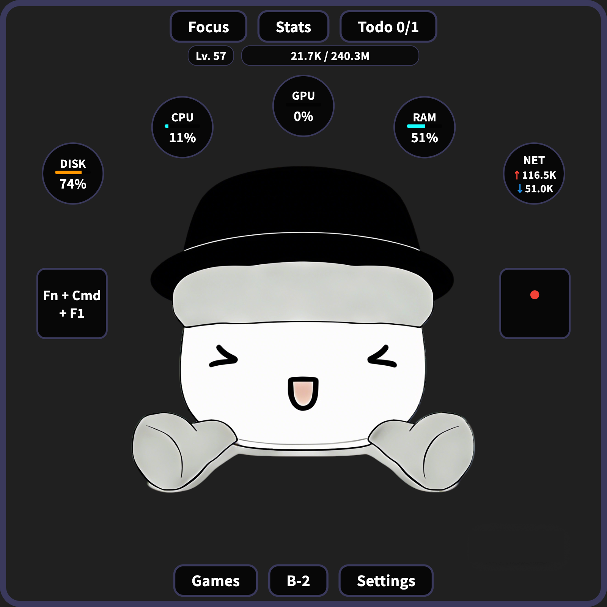

# Cyber Cultivation

[中文](README_ZH.md)

A gamified desktop companion that turns your keyboard and mouse activity into a cultivation journey. Level up your character while you work!


## Screenshots

<p align="center">
  
  &nbsp;
  
</p>

## Features

- **Cultivation System** - Gain experience from keyboard/mouse activity, focus sessions, and games to level up
- **Activity Tracking** - Monitor keyboard and mouse usage in real-time
- **System Monitor** - CPU, GPU, memory, disk, and network usage display
- **Always on Top** - Stay visible while you work
- **Anti-Sleep** - Prevent screen sleep with periodic mouse movement
- **Pomodoro Timer** - Built-in focus timer that also rewards experience
- **Activity Stats** - Daily keyboard/mouse usage statistics with charts
- **Todo List** - Manage daily tasks efficiently
- **Mini Games** - Relax with built-in mini-games to earn extra experience
- **Dark/Light Mode** - Comfortable viewing in any environment
- **Bilingual** - English and Chinese support
- **Launch at Login** - Start automatically with your system

## Installation

### macOS

Download the latest `.dmg` from [Releases](../../releases) and drag to Applications.

> **Note**: On first launch, grant Accessibility permission when prompted (System Settings → Privacy & Security → Accessibility).

### Build from Source

```bash
git clone https://github.com/user/cyber-cultivation.git
cd cyber-cultivation
flutter pub get
flutter run -d macos
```

**Prerequisites**: Flutter SDK 3.10+, Xcode Command Line Tools

## Usage

- **Drag** anywhere to move the window
- **Right-click** for context menu
- **System tray** icon for quick access

## FAQ

### App won't open / "damaged" warning

If macOS blocks the app with a security warning (Gatekeeper), run:

```bash
xattr -d com.apple.quarantine /Applications/CyberCultivation.app
```

### Accessibility permission not working

After granting Accessibility permission, **quit and relaunch** the app for it to take effect.

### Need to reset Accessibility permission

If the app was updated/reinstalled and keyboard/mouse monitoring stops working, reset the permission:

```bash
tccutil reset Accessibility com.lichen.cyberCultivation
```

Then relaunch the app and grant permission again.

## Contributing

Contributions welcome! See [Contributing Guidelines](docs/CONTRIBUTING.md).

## License

[PolyForm Noncommercial License 1.0.0](LICENSE)

- ✅ Free for personal, educational, non-profit use
- ❌ Commercial use requires separate license