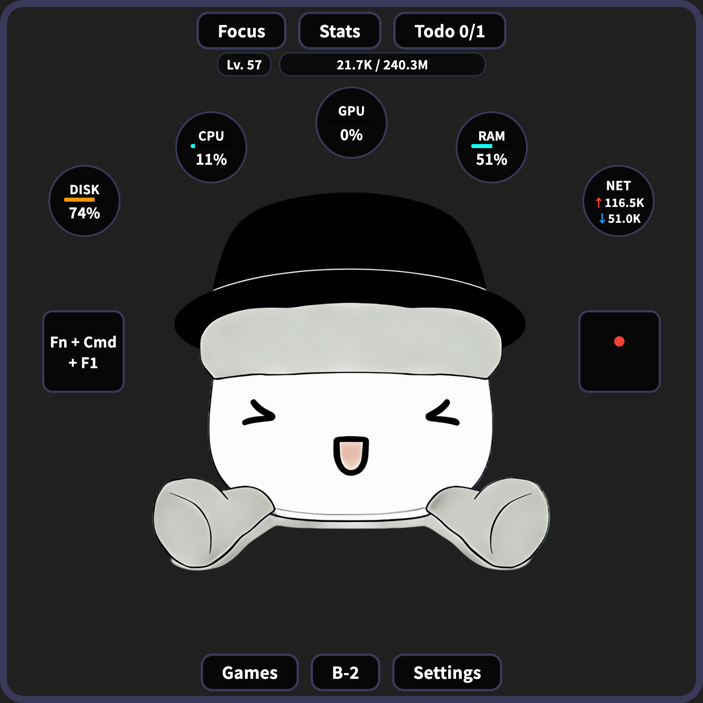

# 赛博修仙

[English](README.md)

一款游戏化的桌面伴侣应用，将你的键盘和鼠标活动转化为沉浸式的修仙之旅。在工作的同时提升角色等级，用番茄钟保持专注，追踪你的生产力——一切尽在精美的悬浮窗口中。


## 游戏截图

<p align="center">
  
</p>

## ✨ 功能特性

### 🎮 游戏化与成长系统
- **修仙系统** — 通过键盘/鼠标活动、专注和小游戏获取经验值并升级
- **升级特效** — 升级时展现绚丽的光芒和粒子爆发动画
- **经验浮动提示** — 实时显示经验值获取通知

### ⏱️ 生产力工具
- **番茄钟** — 内置专注计时器，可自定义工作/休息时长和循环次数，配有精美的修仙阵法动画
- **待办清单** — 管理每日任务，数据持久化存储
- **活动统计** — 每日/每周键盘和鼠标使用图表

### 🖥️ 系统监控
- **实时状态** — CPU、GPU、内存、磁盘使用率和网络速度
- **菜单栏集成** — 在 macOS 菜单栏直接显示番茄钟、等级、系统信息、电量等
- **键盘鼠标可视化** — 实时输入追踪与视觉反馈

### 🎯 小游戏
- **贪吃蛇** — 经典贪吃蛇游戏，获得经验奖励
- **Flappy Bird** — 点击飞行的街机游戏
- **数独** — 益智解谜游戏，三种难度级别

### 🛠️ 桌面功能
- **窗口置顶** — 工作时保持可见
- **防休眠模式** — 通过周期性鼠标移动防止屏幕休眠
- **系统托盘** — 通过托盘图标和菜单快速访问
- **开机启动** — 随系统自动启动

### 🎨 个性化定制
- **深色/浅色主题** — 在任何环境下舒适使用
- **双语界面** — 完整的中英文本地化支持
- **可配置显示** — 自由显示/隐藏键盘追踪器、鼠标追踪器和系统状态

## 📦 安装

### macOS

从 [Releases](../../releases) 下载最新的 `.dmg` 文件，拖入应用程序文件夹即可。

> **注意**：首次启动时，请在弹出提示后授予辅助功能权限（系统设置 → 隐私与安全性 → 辅助功能）。这是键盘和鼠标监控所必需的。

### 从源码构建

```bash
git clone https://github.com/user/cyber-cultivation.git
cd cyber-cultivation
flutter pub get
flutter run -d macos
```

**前置要求**：Flutter SDK 3.10+，Xcode 命令行工具

## 🎯 使用方法

| 操作         | 说明                                   |
| ------------ | -------------------------------------- |
| **拖拽**     | 在屏幕任意位置移动窗口                 |
| **右键点击** | 打开菜单（设置、番茄钟、统计、游戏等） |
| **调整大小** | 拖动窗口边缘（保持 1:1 宽高比）        |
| **托盘图标** | 点击快速访问菜单                       |

## ❓ 常见问题

### 应用无法打开 / 提示"已损坏"

如果 macOS 安全机制（Gatekeeper）阻止应用打开，请在终端运行：

```bash
xattr -d com.apple.quarantine /Applications/CyberCultivation.app
```

### 辅助功能权限不生效

授予辅助功能权限后，请**退出并重新启动**应用才能生效。

### 需要重置辅助功能权限

如果应用更新/重新安装后键盘鼠标监控失效，请重置权限：

```bash
tccutil reset Accessibility com.lichen.cyberCultivation
```

然后重新启动应用并再次授予权限。

## 🙏 致谢

本项目受到以下开源项目的启发，并参考了部分代码和设计思路：

- [Stats](https://github.com/exelban/stats) — macOS 菜单栏系统监控工具
- [vue-xiuxiangame](https://github.com/setube/vue-xiuxiangame) — 基于 Vue 的修仙放置游戏

感谢这些优秀的开源项目！

## 贡献

欢迎贡献！请查看 [贡献指南](docs/CONTRIBUTING.md)。

---

<p align="center">
  <i>将每日的电脑操作转化为史诗般的修仙之旅！🧘‍♂️⌨️</i>
</p>