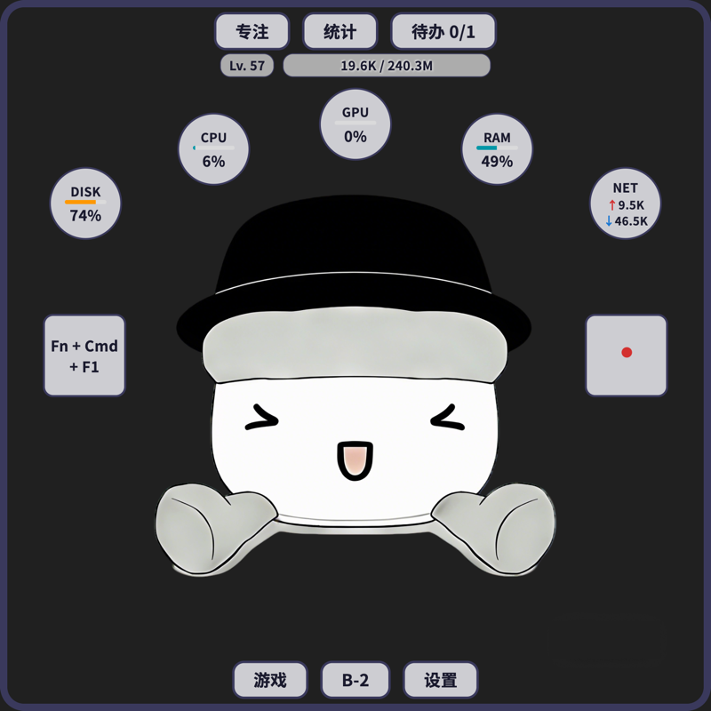
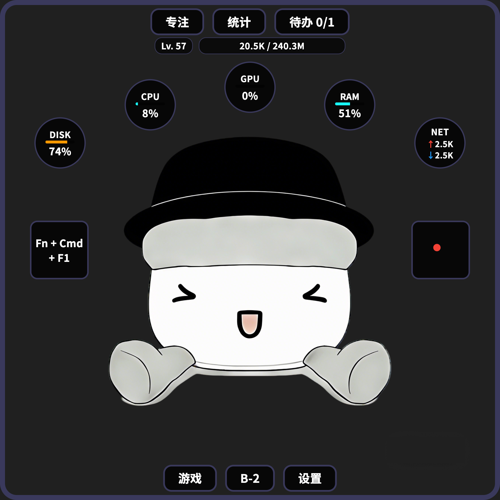

# 赛博修仙

[English](README.md)

一款游戏化的桌面伴侣应用，将你的键盘和鼠标活动转化为修仙之旅。在工作的同时提升你的角色等级！


## 游戏截图

<p align="center">
  
  &nbsp;
  
</p>

## 功能特性

- **修仙系统** - 通过键盘/鼠标活动获取经验值并升级
- **待办清单** - 高效管理每日任务
- **小游戏** - 内置休闲小游戏，赚取额外经验
- **番茄钟** - 内置专注计时器，完成后获得经验奖励
- **活动统计** - 每日键盘/鼠标使用统计图表
- **系统监控** - CPU、内存、磁盘和网络使用情况显示
- **防休眠** - 通过周期性鼠标移动防止屏幕休眠
- **双语支持** - 中文和英文界面
- **深色/浅色模式** - 在任何环境下舒适使用
- **开机启动** - 随系统自动启动
- **窗口置顶** - 工作时保持可见

## 安装

### macOS

从 [Releases](../../releases) 下载最新的 `.dmg` 文件，拖入应用程序文件夹即可。

> **注意**：首次启动时，请在弹出提示后授予辅助功能权限（系统设置 → 隐私与安全性 → 辅助功能）。

### 从源码构建

```bash
git clone https://github.com/user/cyber-cultivation.git
cd cyber-cultivation
flutter pub get
flutter run -d macos
```

**前置要求**：Flutter SDK 3.10+，Xcode 命令行工具

## 使用方法

- **拖拽** 任意位置移动窗口
- **右键点击** 打开菜单
- **系统托盘** 图标快速访问

## 常见问题

### 应用无法打开 / 提示"已损坏"

如果 macOS 安全机制（Gatekeeper）阻止应用打开，请在终端运行：

```bash
xattr -d com.apple.quarantine /Applications/CyberCultivation.app
```

### 辅助功能权限不生效

授予辅助功能权限后，请**退出并重新启动**应用才能生效。

### 需要重置辅助功能权限

如果应用更新/重新安装后键盘鼠标监控失效，请重置权限：

```bash
tccutil reset Accessibility com.lichen.cyberCultivation
```

然后重新启动应用并再次授予权限。

## 贡献

欢迎贡献！请查看 [贡献指南](docs/CONTRIBUTING.md)。

## 许可证

[PolyForm 非商业许可证 1.0.0](LICENSE)

- ✅ 个人、教育、非营利用途免费
- ❌ 商业使用需获得单独许可
